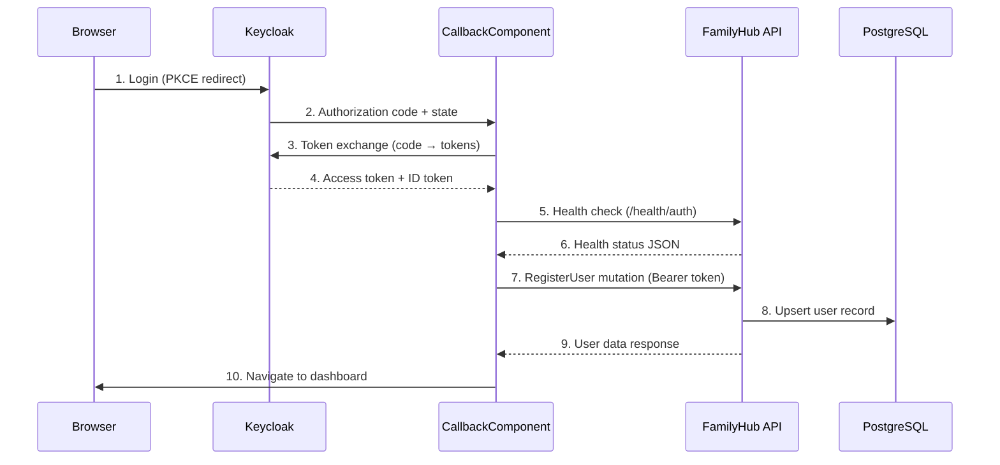

# Auth & Login Workflow

## Architecture Overview



## How It Works

### Step-by-step PKCE Flow

1. **Login redirect** — `AuthService.login()` generates a PKCE code verifier/challenge, stores them in sessionStorage, and redirects to Keycloak's `/auth` endpoint.
   - File: `src/frontend/family-hub-web/src/app/core/auth/auth.service.ts`

2. **Keycloak authentication** — User authenticates with Keycloak (username/password or SSO). Keycloak redirects back to `/callback?code=...&state=...`

3. **Token exchange** — `CallbackComponent.ngOnInit()` calls `AuthService.handleCallback(code, state)` which POSTs to Keycloak's token endpoint with the code verifier.
   - File: `src/frontend/family-hub-web/src/app/features/auth/callback/callback.component.ts`

4. **Backend health gate** — Before calling RegisterUser, the callback checks `/health/auth` to verify the backend (Keycloak OIDC, JWT keys, GraphQL schema) is healthy. If unhealthy, redirects to `/status`.
   - File: `src/frontend/family-hub-web/src/app/shared/services/health.service.ts`

5. **User registration** — `UserService.registerUser()` sends a `registerUser` GraphQL mutation with the JWT Bearer token. The backend upserts the user in PostgreSQL.
   - File: `src/frontend/family-hub-web/src/app/core/user/user.service.ts`

6. **RLS session setup** — `PostgresRlsMiddleware` runs before the GraphQL handler, looking up the user by JWT `sub` claim and setting PostgreSQL session variables for Row-Level Security.
   - File: `src/FamilyHub.Api/Common/Middleware/PostgresRlsMiddleware.cs`

7. **Dashboard redirect** — On success, the callback navigates to the stored post-login redirect URL (default: `/dashboard`).

## Common Failure Modes

| Symptom | Cause | Resolution |
|---------|-------|------------|
| GraphQL returns 404 | Hot Chocolate schema build failure (type extension conflict, missing DI) | `InitializeOnStartup()` now catches this at startup. Check startup logs for schema errors. |
| "Cannot POST /graphql" in browser | Backend not running or schema failed to build | Check Docker: `docker compose logs api`. Verify `/health/auth` returns green. |
| Keycloak unreachable | Container not running or wrong authority URL | `docker compose logs keycloak`. Check `Keycloak:Authority` in config. |
| JWT validation fails | Issuer mismatch between token and backend config | Compare JWT `iss` claim (decode at jwt.io) with `Keycloak:Issuers` config value. |
| RLS user-not-found on first login | Race condition: RegisterUser hasn't committed yet | Automatic 500ms retry in `PostgresRlsMiddleware`. If persistent, check DB connectivity. |
| Stale tokens after env switch | Tokens from one environment used against another | `EnvironmentConfigService.clearStaleAuthIfNeeded()` handles this automatically. |
| "Introspection not allowed" | Hot Chocolate blocks introspection for unauthenticated requests | Expected behavior. Use authenticated requests for introspection. |
| Callback redirects to /status | Backend health check failed before RegisterUser | Visit `/status` page to see which check failed. Fix the failing service. |

## Diagnostic Checklist

When login fails, follow these steps in order:

1. **Check `/health/auth`** — `curl http://localhost:5152/health/auth | jq`
   - All 3 checks should be `Healthy` (keycloak_oidc, jwt_signing_keys, graphql_schema)

2. **Check Docker containers** — `docker compose ps`
   - All services should show `Up (healthy)`

3. **Check Keycloak realm** — Navigate to `http://localhost:8080/admin`
   - Verify `FamilyHub` realm exists with `familyhub-web` client

4. **Check browser console** — Open DevTools → Console
   - Look for CORS errors, network failures, or GraphQL errors

5. **Check API logs** — `docker compose logs api --tail=50`
   - Look for schema build errors, DI resolution failures, or auth errors

6. **Check frontend /status page** — Navigate to `http://localhost:4200/status`
   - Shows real-time health of all backend services

## Testing

### Integration Tests (no Docker required)

```bash
dotnet test tests/FamilyHub.IntegrationTests/
```

Tests use `FamilyHubWebApplicationFactory` with:

- **InMemoryDatabase** instead of PostgreSQL
- **Mock JWT tokens** instead of Keycloak (`MockJwtTokenGenerator`)
- RLS middleware skipped (Testing environment)

Key tests:

- `GraphQLEndpoint_ReturnsOk_NotFourOhFour` — **Critical regression test** for schema build failures
- `HealthAuthEndpoint_ReturnsDetailedStatus` — Validates health check infrastructure
- `GraphQLEndpoint_WithMockJwt_ReturnsOk` — Full auth pipeline with mock JWT

### E2E Tests (requires Docker)

```bash
dotnet test tests/FamilyHub.IntegrationTests/ --filter "Category=E2E"
```

Uses Testcontainers for real Keycloak + PostgreSQL instances.

## Monitoring

### Health Endpoints

| Endpoint | Purpose | Auth Required |
|----------|---------|---------------|
| `/health` | Simple liveness check (Docker HEALTHCHECK) | No |
| `/health/auth` | Detailed auth infrastructure status (3 checks) | No |

### Frontend Status Page

- **URL:** `/status` (public, no auth required)
- **Polls:** `/health/auth` every 5 seconds
- **Shows:** Per-service health with color-coded indicators
- **Use when:** Backend is unreachable or login fails

### Response Format (`/health/auth`)

```json
{
  "status": "Healthy",
  "checks": {
    "keycloak_oidc": { "status": "Healthy", "description": "OIDC discovery loaded (issuer: ...)" },
    "jwt_signing_keys": { "status": "Healthy", "description": "2 signing key(s) available" },
    "graphql_schema": { "status": "Healthy", "description": "142 types loaded" }
  }
}
```
